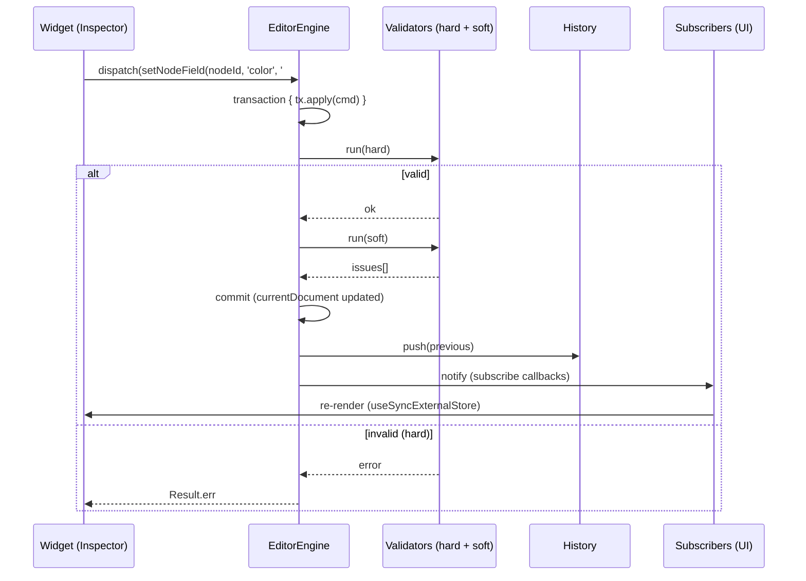

import InlineSvg from '../../../../components/InlineSvg.astro'
import arquitectura from '../../../../assets/diagramas/arquitectura.svg?raw'

**For code contributors who want to understand how the pieces are organized before touching them.** Assumes you already know the editor from the [Editor guide](../../editor/guia/).

---

## The map at a glance

<InlineSvg html={arquitectura} alt="Architecture: the JSON document validates and loads into core (TreeEngine), and the snapshot feeds the React renderer, the Studio and the CLI; common underneath; the editor produces the document" />

The data is the centre: the **JSON document** validates and loads into `core` (`TreeEngine`), and the resulting snapshot feeds the React renderer, the Studio and the CLI alike — three consumers, one truth. The Studio also **produces** the document (the arrow back). For the concrete methods, see the [API reference](../../referencia-api/) generated from the TSDoc.

## Guiding principles

Before looking at the code, these are the three principles that **decided the shape of everything**:

1. **Same Data. Different Themes.** The data (a progression graph) is **invariant**. Rendering, UX and effects are **variants**. This applies to visual themes as much as to usage contexts (educational, gaming, certifications).
2. **Domain Model: the Registry describes CONCEPTS, not widgets.** The Property Registry says "this field is a number between 1 and 10". The React Inspector resolves a concrete widget (a number input). Another UI (Tauri, CLI, voice) could resolve a different widget from the same Registry. **Zero coupling between domain and presentation.**
3. **The mouth cannot diverge from the conscience.** The editor (mouth) must NEVER offer options the runtime (conscience) doesn't know how to apply. That is the **manifest–descriptor gate**, which you will see repeated across several layers.

---

## The five layers

```
┌─────────────────────────────────────────────────────────────┐
│                    Apps (consumers)                          │
│  examples/editor    examples/oberon-panadeiro    ...         │
└──────────┬─────────────────────┬─────────────────────────────┘
           │                     │
┌──────────▼─────────────────────▼─────────────────────────────┐
│              @yggdrasil-forge/editor-react                    │
│  Editor React UI: panels, canvas, inspector, sub-editors      │
└────────────────────────┬──────────────────────────────────────┘
                         │
┌────────────────────────▼──────────────────────────────────────┐
│              @yggdrasil-forge/editor-core                     │
│  Headless: Engine, Command, Transaction, Selection, History,  │
│  Property Registry, Validators (hard + soft)                  │
└────────────┬──────────────────────────────────┬───────────────┘
             │                                  │
┌────────────▼──────────┐         ┌─────────────▼───────────────┐
│  @yggdrasil-forge/    │         │  @yggdrasil-forge/react     │
│  core                 │         │  SkillTree rendering with   │
│  Domain types,        │         │  SVG + viewport + themes    │
│  runtime, manifest,   │         │                             │
│  validators, layout   │         │                             │
└────────────┬──────────┘         └─────────────┬───────────────┘
             │                                  │
             ▼                                  ▼
       @yggdrasil-forge/common (shared types: LocalizedString, ...)
```

### `@yggdrasil-forge/common`
Cross-cutting types with no logic. The most used one: `LocalizedString = string | Record<string, string>`.

### `@yggdrasil-forge/core`
**The pure domain.** Types (`NodeDef`, `EdgeDef`, `TreeDef`, `Effect`, `UnlockRule`, `Resource`, …), runtime (UnlockResolver, EffectsRunner), hard validators, layout engine. **Zero React.** Usable from Node, a CLI, Tauri, or another frontend.

**Key pieces**:
- `TreeEngine`: the "live state" of a tree. Applies unlocks, runs effects, keeps `NodeState`.
- `supportManifest`: the registry of which `Effect` types and `UnlockCondition` types the runtime actually applies. **The machine's "conscience"** (see §manifest gate).
- `Layout`: the algorithms (`compute`, `radial`, …) that assign `position` to nodes.

### `@yggdrasil-forge/react`
**Visual rendering.** SVG SkillTree, viewport (pan/zoom), icon sets, themes. Consumes a `TreeEngine` and paints it. **Knows nothing about the editor.** Usable in Preview, Authoring (through the editor canvas) or in non-editor apps.

### `@yggdrasil-forge/editor-core`
**The editor's headless engine.** Adds an **editing** layer on top of `@core`:
- `EditorEngine`: orchestrates Commands, Transactions, History, Validation.
- `EditorDocument` = `{ tree: TreeDef, editor: EditorMeta }`.
- `Command` / `Transaction`: the atomic unit of change.
- `History` (Immer snapshots): undo/redo.
- `SelectionEngine`: which nodes/edges/groups/regions are selected.
- `Operation` / `Tool`: abstractions for interactions with preview (drag-move, marquee).
- **Hard validators** (structural, uniqueIds, referentialIntegrity) — block invalid commits.
- **Soft validators** (asymmetricExclusion, prerequisiteCycle, layoutOverflow, unsupportedFeature, danglingResourceRefs) — don't block, emit warnings (`ValidationIssue`).
- **Property Registry** (descriptors of the editable `NodeDef`).
- **Manifest–descriptor gate** (`authorableEffectTypes()`).

**Zero React here too.** Another UI could read the same Registry and render its own.

### `@yggdrasil-forge/editor-react`
**The editor's React UI**: panels (Outliner, Inspector, Problems), Canvas (wraps the SkillTree + selection/ghost/marquee overlay), widgets, structured sub-editors.

---

## The flow of one edit — bird's-eye view



### Detailed steps

1. **The user edits a widget** (e.g. changes the color).
2. The widget calls `descriptor.set(nodeId, '#ff0000')`, which returns a `Command` (a serializable object with `type` + `mutate(draft)`).
3. The `InspectorPanel` calls `editorEngine.dispatch(cmd)`.
4. `dispatch` opens a **Transaction** internally, applies the command, and runs the **hard** validators.
5. If the hard ones pass, it runs the **soft** ones and stores the result in `currentIssues`.
6. It replaces `currentDocument` with the new one, does `history.push(previous)`, and notifies subscribers.
7. Every `useSyncExternalStore` re-renders: the canvas shows the new color, the Inspector shows the new value, the ProblemsPanel updates warnings.

---

## EditorDocument — the root structure

```ts
interface EditorDocument {
  readonly tree: TreeDef          // The canonical data (defined in @core)
  readonly editor?: EditorMeta    // Editor-only metadata (NOT serialized for the runtime)
}
```

- **`tree`** is what a non-editor consumer (preview, runtime) loads. It holds nodes, edges, resources, layout config.
- **`editor`** holds local metadata: `coordinateBounds`, persisted viewport, and in the future: author notes, panel positions, etc. It doesn't affect the runtime.

When the editor saves the tree for Preview, **it only serializes `tree`**. The `JsonDocumentAdapter` decides the format.

---

## Command + Transaction — the atomic unit of change

Every change to the document goes through here. **There is no direct mutation of `currentDocument`.**

```ts
interface Command {
  type: string                            // e.g. 'setNodeField', 'addNode', 'moveNode'
  label?: LocalizedString                 // for the history entry
  mutate(draft: EditorDocument): void     // executed inside an Immer produce()
}
```

**Why Immer?** It lets you write seemingly "imperative" mutations (`node.color = '#ff0000'`) while producing a new immutable document. That is the basis of `useSyncExternalStore`: every commit yields a new reference → React detects the change → re-render. Without Immer, we'd either copy by hand (verbose) or lose efficiency.

### Transaction
A transaction may contain **several commands**. That is the key to **drag = 1 history entry**, even when 5 nodes move.

```ts
editorEngine.transaction({ en: 'Move' }, (tx) => {
  for (const cmd of moveCommands) {
    tx.apply(cmd)
  }
})
// All commands apply atomically:
// - If any hard validator fails → full rollback (zero changes).
// - If all pass → 1 history entry.
```

---

## Selection — what is selected

```ts
type SelectionRef =
  | { kind: 'node'; id: string }
  | { kind: 'edge'; id: string }
  | { kind: 'group'; id: string }
  | { kind: 'region'; id: string }
```

`SelectionEngine` is a reactive store:
- `current()` → array of refs.
- `subscribe(cb)` → notifies changes.
- `replace([...])`, `add(ref)`, `toggle(ref)`, `clear()`.

> **⚠ Historical scar**: `current()` **returns a new array on every call**. That breaks `useSyncExternalStore` (which needs stable references when nothing changed). **Pattern**: a local cache in `useRef`, refreshed ONLY inside the subscribe callback. See `useSelectedRefs` in `EditorCanvas.tsx` or `InspectorPanel.tsx` for the pattern.

---

## Operation — preview + commit in bulk

For interactions with live feedback (drag-to-move, marquee), Operations encapsulate the **provisional** state without touching the document until the final commit.

```ts
interface Operation {
  update(point, modifiers): void
  preview(): OperationPreview      // { nodePositions?: Map<id, pos> }
  commit(): readonly Command[]     // Commands to apply in a transaction
  cancel(): void
}
```

**MoveOperation** (the only one implemented so far):
1. On drag start: captures the initial positions of the selected nodes.
2. `update(currentDoc)` on every pointermove: computes offsets, updates `preview().nodePositions`.
3. **The React Overlay** draws the ghosts at the preview positions. **The document hasn't been touched yet.**
4. On release: `commit()` returns `moveNode` commands → `engine.transaction()` → 1 history entry.
5. On Escape: `cancel()` → zero side effects.

> **★ Banked architectural decision**: the `InteractionController` + `Tools` (`SelectTool`, `MoveTool`) from 7.3 stay **dormant** until a tool-bar UI exists (v1.2). The v1 editor uses Operations directly from the canvas. Reason: the Tool model decides on every atomic `InputEvent`; the real "drag vs click by threshold" case doesn't fit.

---

## History — undo / redo

```
[doc₀]  →  edit  →  [doc₁]  →  edit  →  [doc₂]  ← currentDocument
   ↑                  ↑                  ↑
   └─ history[0]      └─ history[1]      
                                          (pointer to the "present")
```

- Every commit does `history.push(previousDocument)`.
- `undo()` moves the pointer back. `redo()` forward.
- Immutable: every document is an Immer snapshot, structurally shared (zero deep copies).
- `maxHistory` bounds memory (default 100).

---

## Property Registry — describing what is editable

```ts
type PropertyType =
  | { kind: 'text' }
  | { kind: 'localizedText' }
  | { kind: 'number'; min?, max?, step? }
  | { kind: 'enum'; options: readonly string[] }
  | { kind: 'color' }
  | { kind: 'boolean' }
  | { kind: 'structured'; of: 'effects' | 'prerequisites' | 'exclusions' | 'cost' | 'tiers' | 'costPerTier' }

interface PropertyDescriptor<T = unknown> {
  key: string                    // field on NodeDef (e.g. 'color', 'label')
  label: LocalizedString         // how to show it in the UI
  type: PropertyType             // which widget it needs
  group: 'identity' | 'appearance' | 'logic'
  readonly?: boolean
  describe?: LocalizedString
  get(node: NodeDef): T | undefined
  set(nodeId: string, value: T): Command
}

export const nodePropertyRegistry: readonly PropertyDescriptor[] = [
  // id (readonly), type (enum), label (localizedText), description,
  // color, icon, shape (enum), size (number),
  // tier (number), maxTier (number),
  // cost (structured), costPerTier, tiers, effects, prerequisites, exclusions
]
```

**Why this pattern?**
- The React Inspector iterates the registry, groups by `group`, and renders a widget by `type.kind`. **Zero hard-coded fields in the Inspector.**
- Adding a new field means adding one registry entry. The Inspector picks it up automatically.
- `set` returns a Command (mutates nothing). Mutation is explicit and atomic.

### No-drift type test
The enum options (`NODE_TYPE_OPTIONS`, `NODE_SHAPE_OPTIONS`) are `as const` tuples with a type test:

```ts
type Equals<A, B> = ... // exact-equality helper
const _check: Equals<(typeof NODE_TYPE_OPTIONS)[number], NodeType> = true
```

If `@core` adds a value to `NodeType` without updating the tuple → typecheck fails. **Zero silent drift.**

---

## Validators — hard vs soft

### Hard (always on, automatic in the engine)
They block invalid transactions. **`dispatch` returns `Result.err`**, the document doesn't change.

- `structuralValidator`: the document has the minimum structure (tree + nodes + …).
- `uniqueIdsValidator`: no duplicate ids.
- `referentialIntegrityValidator`: edges/prerequisites/exclusions reference existing nodes.

### Soft (optional, registered with `createDefaultValidators()`)
They don't block. They emit `ValidationIssue`s that the engine stores in `currentIssues`. **The ProblemsPanel renders them.**

- `asymmetricExclusionValidator`: A→B without B→A.
- `prerequisiteCycleValidator`: a cycle in prerequisites.
- `layoutOverflowValidator`: nodes outside the bounds.
- `unsupportedFeatureValidator`: the tree uses a `modify_stat` or `plugin` Effect type.
- `danglingResourceRefsValidator`: costs referencing resources the tree doesn't define.

### ⚠ How to register them
```ts
const engine = new EditorEngine(doc, {
  validators: createDefaultValidators(),  // ← the soft ones. Hard ones are automatic.
})
```

Without passing `validators`, the `ProblemsPanel` will stay empty forever. **That happened in `examples/editor` until 7.5c-ii phase 1**, where it was discovered while testing the conscience–voice loop.

---

## ★ supportManifest — the machine's conscience

`supportManifest` is a registry that **`@core` exports** about which features the runtime actually supports. It lives in `packages/core/src/engine/supportManifest.ts`.

```ts
export const SUPPORTED_EFFECT_TYPES = [
  'modify_resource', 'modify_node_state', 'set_node_visibility',
  'unlock_node', 'set_progress', 'trigger_event',
  'conditional', 'composite',
] as const

export const UNSUPPORTED_EFFECT_TYPES = ['modify_stat', 'plugin'] as const

// Exhaustive type test:
type _check = Equals<Effect['type'], (typeof SUPPORTED_EFFECT_TYPES)[number] | (typeof UNSUPPORTED_EFFECT_TYPES)[number]>
// If @core adds an Effect kind without classifying it → typecheck fails.
```

### Why does it exist?
The `Effect` union is declared in the domain schema (the shape of the data). **But not every type is applied by the runtime** — some are placeholders for the future (`modify_stat`) or for external integration (`plugin`).

That creates a risk: the editor could let you author a `modify_stat`, it gets saved in the JSON, and when the runtime tries to apply it… **nothing happens**. A silent bug.

**Solution**: the manifest. Three mechanisms in concert:
1. The `SUPPORTED` / `UNSUPPORTED` tuples (data).
2. The type test (compile time: guarantees full coverage).
3. **The EffectsRunner consults the manifest to decide whether to apply** (`if (UNSUPPORTED.includes(effect.type)) return skipResult()`).

---

## ★ Manifest ↔ descriptor gate — the mouth doesn't diverge from the conscience

`@editor-core` exports:

```ts
import { SUPPORTED_EFFECT_TYPES } from '@yggdrasil-forge/core'

export function authorableEffectTypes(): readonly string[] {
  return SUPPORTED_EFFECT_TYPES
}

export function authorablePlainEffectTypes(): readonly string[] {
  return SUPPORTED_EFFECT_TYPES.filter(t => t !== 'composite' && t !== 'conditional')
}
```

The `EffectsEditor` (React sub-editor) uses **`authorablePlainEffectTypes()`** to feed the "add effect" `<select>`. **The Inspector can NEVER propose `modify_stat` or `plugin`** — they are UNSUPPORTED.

### The gate test (worth reading)

```ts
it('★ Manifest–descriptor gate: matches the manifest SUPPORTED set', () => {
  const authorable = new Set(authorableEffectTypes())
  const supported = new Set(SUPPORTED_EFFECT_TYPES)
  expect(authorable).toEqual(supported)
})

it('EXCLUDES modify_stat and plugin (UNSUPPORTED)', () => {
  expect(authorableEffectTypes()).not.toContain('modify_stat')
  expect(authorableEffectTypes()).not.toContain('plugin')
})
```

This guarantees the **mouth** (Inspector) **cannot diverge** from the **conscience** (engine):
- If `@core` adds an Effect kind as SUPPORTED → it appears in the selector automatically (zero changes).
- If it adds it as UNSUPPORTED → it stays excluded.
- If it doesn't classify it → the manifest type test fails at compile time.

The same pattern applies to UnlockCondition since 7.5c-ii phase 2.

---

## ★ Conscience ↔ voice loop

```mermaid
graph LR
    A[User edits a field<br/>e.g. foo.exclusions = bar] --> B[setNodeField Command]
    B --> C[EditorEngine dispatch]
    C --> D[Transaction + commit]
    D --> E[Soft validators run]
    E -->|asymmetricExclusion detects<br/>bar lacks foo| F[ValidationIssue created]
    F --> G[engine.currentIssues updated]
    G --> H[engine.subscribe notify]
    H --> I[ProblemsPanel re-renders<br/>useSyncExternalStore]
    I --> J[User clicks the warning]
    J --> K[selection.replace nodeId]
    K --> L[InspectorPanel + Canvas<br/>focus the node]
    L --> M[User fixes it]
```



**This is what makes the editor "conscious".** You edit something dubious → the system detects it → you find out → you fix it. The loop closes from data → engine → UI → user → data.

The ★ test covering the whole circuit is in `packages/editor-react/__tests__/StructuredEditors.test.tsx`.

---

## Real-time rendering — `useSyncExternalStore`

```ts
const doc = useSyncExternalStore(
  (cb) => editorEngine.subscribe(cb),
  () => editorEngine.getDocument(),
)
```

Every engine commit notifies subscribers. Every subscriber re-renders. That is how the Inspector, the Canvas and the ProblemsPanel **stay in sync** without prop drilling or Redux.

### ⚠ Scar: stable cache
`SelectionEngine.current()` returns **a new array on every call**. That sends `useSyncExternalStore` into a loop (`Maximum update depth exceeded`). **Pattern**:

```ts
const cacheRef = useRef<readonly SelectionRef[]>([])
const subscribe = useCallback((cb) => {
  const unsub = selection.subscribe(() => {
    cacheRef.current = selection.current()
    cb()
  })
  cacheRef.current = selection.current()
  return unsub
}, [selection])
const getSnapshot = useCallback(() => cacheRef.current, [])
return useSyncExternalStore(subscribe, getSnapshot, getSnapshot)
```

The cache only refreshes when the subscription fires. Between firings it returns the same ref → `useSyncExternalStore` is happy.

---

## Historical scars (★ worth knowing)

Situations where a bug was only caught by visual review (not by automated tests):

### A.6.30 — Asymmetric exclusions (reverse index)
**Problem**: `A→B` exclusions needed `B→A` to apply at runtime too, but the index only looked at "side A". That broke gameplay.
**Solution**: a reverse index built at `TreeEngine` initialization. `getEffectiveExclusions(nodeId)` returns both the declared and the inferred ones. **See `TreeEngine.ts`.**

### A.6.39/40 — CTM of the inner `<g>` (misaligned overlay)
**Problem**: the React overlay (rings, ghosts) took `getScreenCTM()` from the root `<svg>`. But the SkillTree's pan/zoom transform lives on an inner `<g>`. Result: overlay misaligned with the render when zooming.
**Solution**: `findCanvasCtmElement` looks for the first `<g>` descendant of the `<svg>`. `getCtmScale` lets rings and ghosts **scale with the zoom**.
**Priority bank**: expose `screenToWorld`/`worldToScreen` on `SkillTreeHandle` to remove the structural knowledge.

### `useSyncExternalStore` loop with `selection.current()`
Documented above in §"Scar: stable cache".

---

## Monorepo structure

```
yggdrasil-forge/
├── packages/
│   ├── common/                 # shared types, Result, LocalizedString, errors
│   ├── core/                   # domain + runtime
│   │   ├── src/types/          # NodeDef, EdgeDef, Effect, Cost, ...
│   │   ├── src/engine/         # TreeEngine, EffectsRunner, supportManifest, treeDefSchema (Zod)
│   │   └── src/engine/layouts/ # layout engines (radial, tree, layered, clustered-radial, constellation)
│   ├── react/                  # SVG SkillTree + viewport + themes + icon sets
│   ├── editor-core/            # the editor's headless engine
│   │   ├── src/EditorEngine.ts
│   │   ├── src/command/        # Command, Transaction, History
│   │   ├── src/selection/      # SelectionEngine
│   │   ├── src/operation/      # MoveOperation, Operation interface
│   │   ├── src/validation/     # hard + soft + createDefaultValidators
│   │   ├── src/property/       # PropertyDescriptor, nodePropertyRegistry, authorableEffectTypes
│   │   ├── src/layout/         # applyAutoLayout (Dispor) + defaultLayoutConfigs
│   │   └── src/document/       # serialize/deserialize, ThemeSpec, themePresets
│   ├── editor-react/           # React UI
│   │   └── src/
│   │       ├── EditorShell.tsx
│   │       ├── canvas/         # EditorCanvas, CanvasOverlay, DisporMenu, ClusterCardsView
│   │       ├── inspector/      # InspectorPanel, TreeInspector, widgets, structured/
│   │       ├── panels/         # OutlinerPanel, ProblemsPanel, ThemePanel, code/ (CodeMirror)
│   │       ├── proba/          # ProbaPanel + useProbaSession
│   │       └── shell/          # TopBar, menus, StatusBar, ShellRuntimeContext
│   └── cli/                    # ygg: validate, layout, render, schema, new
├── examples/
│   ├── editor/                 # the runnable editor app
│   ├── gallery/                # gold documents (guaranteed by test)
│   └── …                       # react-demo, learn-yggdrasil, cyberware-ripperdoc, …
├── schema/                     # published JSON Schema of the document
├── docs/architecture/          # MASTER.md (canonical), EDITOR_DOMAIN_MODEL, ROADMAP
├── docs-site/                  # this documentation (Astro/Starlight)
└── tools/icon-preview/         # icon previewer
```

---

## Banked decisions

Known problems or improvements that block nothing but are noted for when usage asks for them (doctrine §13: generality is earned case by case):

1. **`screenToWorld`/`worldToScreen` on `SkillTreeHandle`** (`@react`). Would remove the editor's need to know the SkillTree's internal DOM structure. The handle already exposes `fit`, `zoomIn/Out` and `centerOn` (7.18b); coordinate conversion stays banked.
2. **`createSoftValidators` rename** (from `createDefaultValidators`): the current name is misleading because the hard ones are default too.
3. **Canvas locale**: there is no way to change the active locale; the `LocalizedString` editor edits `gl` by default and preserves the others.
4. **Visual icon picker**: the `logic-*`/`norse-*` sets are typed by id (the field's help lists them).
5. **SVG culling/virtualization at atlas scale** (>1,500 nodes): after the 16.4 memoization, what remains is browser layout; post-1.0.
6. **dockview-react v7** once it stabilizes.

---

## Where we are

The editor core (Phase 14) and most of the Studio (Phase 15) are done: creation tools, import/export, Code panel with validation, cards view, "Dispor" auto-layout (six engines), image export, named theme presets and official icon sets. The real state versus the roadmap is kept in the repo: [`docs/architecture/ROADMAP-1.0-RENDERER-TO-STUDIO.md`](https://github.com/fraga-labs/yggdrasil-forge/blob/main/docs/architecture/ROADMAP-1.0-RENDERER-TO-STUDIO.md) and [`MASTER.md`](https://github.com/fraga-labs/yggdrasil-forge/blob/main/docs/architecture/MASTER.md) (with the Annex of lessons).

To **add capabilities** yourself, read the [Extension guide](../../extension/guia/).
To **use the editor**, read the [Editor guide](../../editor/guia/).
