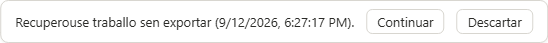
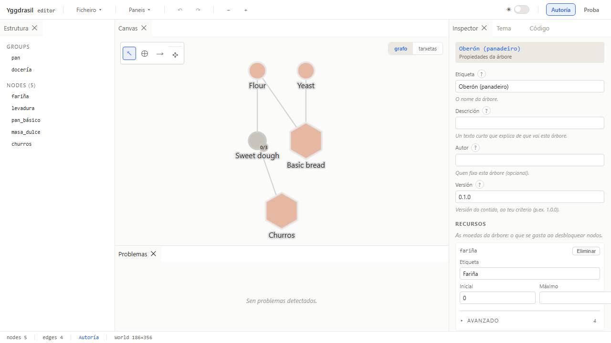
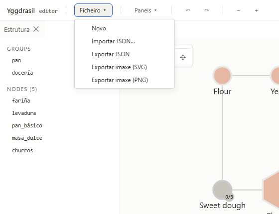
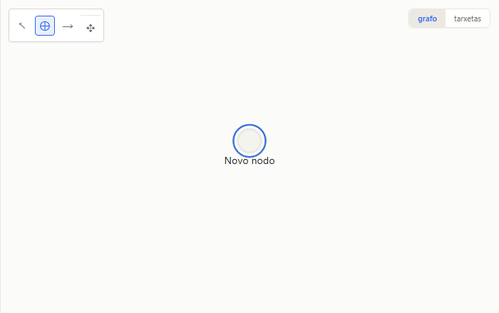
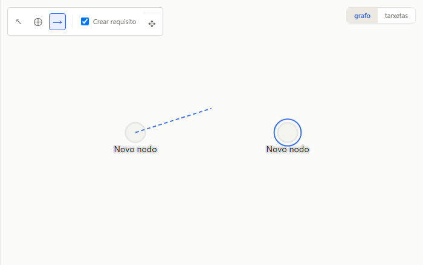
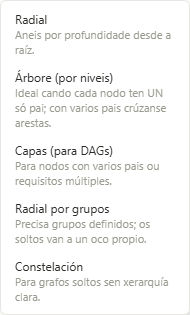
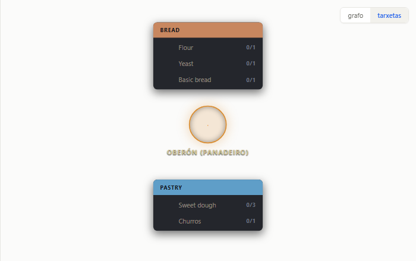
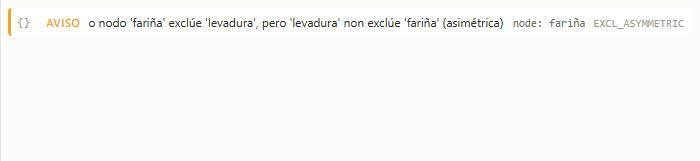
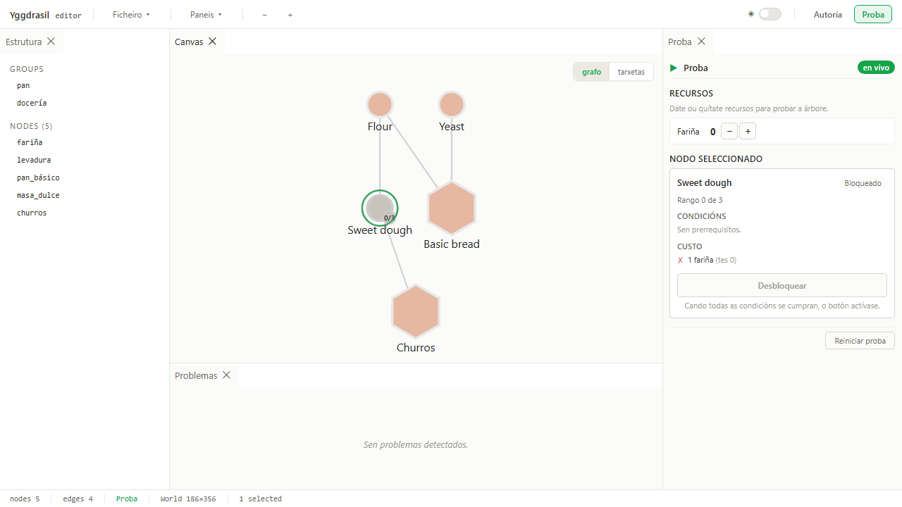

**For whoever opens the editor and wants to build a skill tree without necessarily knowing the code.** And opening it is one click: [**the live editor**](https://fraga-labs.github.io/yggdrasil-forge/app/) runs entirely in your browser, no account, nothing to install. Editor state: 1.x — the Studio shipped with 1.0.

> The editor's interface is in **Galician**. This guide gives each label as it appears on screen, with its English meaning in parentheses the first time.

## What the editor is

Yggdrasil Forge is a visual editor for **progression graphs**: skill trees, educational curricula, tech trees, quest trees… Any "to reach B you need A first" structure can be modelled with the same tool.

The editor is a **web app** living in `examples/editor`:

```bash
corepack pnpm --filter @yggdrasil-forge-examples/editor run dev
```

On startup it loads the **baker** example tree. To open another one, use the **Ficheiro** (File) menu (see below) or paste a JSON into the **Código** (Code) panel.

### Two modes: Autoría and Proba

In the top-right corner there are two buttons: **Autoría** (authoring) and **Proba** (play).

- **Autoría**: you are **editing** the tree. Moving nodes, changing properties, connecting, theming…
- **Proba**: you are **playing** the tree the way the end user would: you grant resources, unlock nodes, watch the states fill in. **Changes made in Proba are not saved into the document** — it is a simulation session, and the *Reiniciar* (reset) button starts over.

Start in Autoría. Switch to Proba to feel it. Go back to Autoría to adjust. The panel layout is kept across mode switches.

### Survival and installation

The document **autosaves** (about 1 s after each change): if you close or reload without exporting, a banner appears on return — *"Recuperouse traballo sen exportar" (unexported work was recovered) — Continuar / Descartar*. *Novo* starts clean (nothing to recover); **exporting remains the real save**.



 And the editor is a **PWA**: it works fully offline and Chrome/Edge offer to install it as a desktop app.

## The panels



The screen is split into resizable panels. You can close them with the tab's ✕ and reopen them from the **Paneis** (panels) menu in the top bar, which also has **Restaurar disposición** (restore layout). The layout is saved between sessions.

| Panel | Where | What for |
|---|---|---|
| **Estrutura** (structure) | left | List of groups and nodes. **Click a node = select it and center the view on it.** |
| **Canvas** | center | The canvas: nodes, edges, creation tools, Dispor, and the **grafo / tarxetas** (graph / cards) toggle. |
| **Problemas** (problems) | center bottom | The warnings of the editor's "conscience". Click a warning = go to the affected node. |
| **Inspector** | right | The properties of the selected node (or of the tree, when nothing is selected). |
| **Tema** (theme) | right (tab) | The document's visual theme: presets, per-state fills, regions, background. |
| **Código** (code) | right (tab) | The document's live JSON, editable and validatable. |
| **Proba** | right (Proba mode only) | Session resources, unlock/remove tiers of the selected node, reset. |

The **status bar** at the bottom shows nodes, edges, mode and world size (`World W×H`).

## The top bar

- **Ficheiro** → *Novo* (new), *Importar* (import a document-format `.json`), *Exportar JSON*, *Exportar imaxe SVG* and *PNG* (graph view only).
- **Paneis** → reopen closed panels, restore layout.
- **↶ ↷** → undo / redo (also Ctrl+Z / Ctrl+Y).
- **− +** → zoom the canvas out / in.
- **☀ / 🌙** → light/dark theme of the editor *chrome* (not of the document — see [Theming](../../theming/)).
- **Autoría / Proba** → the mode.



## The canvas

### Tools (floating canvas bar, Autoría + graph view only)

| Tool | Shortcut | What it does |
|---|---|---|
| **Seleccionar** (select) | `V` | Click selects, Shift+click adds/removes, Shift+drag on empty space draws a selection rectangle, dragging a node moves it. |
| **Engadir nodo** (add node) | `N` | Click on empty space creates a new node there. |
| **Conectar** (connect) | `C` | Drag from one node to another to create an edge. With the option *"Ao conectar, o destino pasa a requirir a orixe"* ("when connecting, the target starts requiring the source") enabled (the default), the edge also adds the prerequisite; untick it for a purely visual connection. |

`Delete` removes the selection. `Escape` cancels the ongoing interaction without touching the document.





### Move, pan and zoom

- **Drag a node** → it moves (with several selected, they all move together, and a single *undo* brings them back).
- **Drag the background** → pan. **Mouse wheel** → zoom towards the cursor. The **− +** buttons in the top bar do the same.
- On **large** trees (40 nodes or more) a **minimap** appears in the bottom-left corner: it shows the whole tree, a rectangle for what you are looking at, and **clicking it takes you there**. Small trees do not get one — the tree already fits on screen and it would only take up room.
- **Estrutura → click a node** → the view centers on it (handy in large trees).

### Dispor — place every node automatically

The **✥ Dispor** (arrange) button opens a menu with five algorithms; each carries its usage condition underneath:

| Algorithm | Use it when… |
|---|---|
| **Radial** | you want rings by depth from the root. |
| **Árbore (por niveis)** — tree by levels | every node has **a single parent**; with several parents, edges cross. |
| **Capas (para DAGs)** — layers for DAGs | there are nodes with **several parents** or multiple requirements (the usual case in educational trees). |
| **Radial por grupos** — clustered radial | you have groups defined; loose nodes get their own slot. |
| **Constelación** — constellation | the graph is loose, with no clear hierarchy. |




Dispor **bakes** the positions into the document (it is not a "live" layout): afterwards you can tweak by dragging, and **a single undo** restores all previous positions and framing. If you import a tree without positions, the canvas offers the algorithms in an invitation bar. More in [Layouts](../../layouts/).

### Graph / cards view

The corner toggle switches between the **graph** (classic SVG) and the **cards**: each group is a card and each member node a row with icon, label and tier. Cards are a structural view (selecting and deleting work; moving and connecting belong to the graph).



## Inspector — editing properties

With **one** node selected, the Inspector shows its fields in two blocks: **Básico** (basic, visible) and **Avanzado** (advanced, collapsed). With nothing selected, it shows the **tree** fields (label, description, author, version) and the **Recursos** (resources) editor.


### Node fields

- **Identity**: `id` (read-only), **Tipo** (type: `small`, `notable`, `keystone`, `mastery`, `ascendancy`, `root`, `cluster`, `gateway`, `milestone`, `subtree_anchor`, `custom`), **Etiqueta** (label) and **Descrición** (description) — localizable; the `gl` locale is edited and the others are preserved.
- **Appearance**: **Cor** (color), **Icona** (icon: an emoji, an image URL or an id from the bundled sets `logic-*`, `norse-*` and `forge-*` — the **Escoller icona** button opens the visual picker), **Zoom da imaxe** (image zoom, image icons only), **Forma** (shape: `circle`, `square`, `diamond`, `hexagon`, `octagon`) and **Tamaño** (size).
- **Logic**: **Rangos** (tiers, `maxTier`), **Custo** (cost: resource/amount pairs), **Custo por rango** (cost per tier), **Efectos** (effects), **Prerrequisitos** (prerequisites) and **Exclusións** (exclusions).


### Prerequisites

The editor reads like a sentence: *"This node unlocks when [Todas / Algunha / Ningunha] (all / any / none) of these conditions hold"*, followed by the list of conditions (node unlocked, minimum resource, tag count…). Creating a cycle `A → B → A` raises a warning in Problemas.

### Effects

Each effect has a small form according to its type. The "add effect" selector only offers the types the runtime **knows how to apply** (`modify_resource`, `modify_node_state`, `set_node_visibility`, `unlock_node`, `set_progress`, `trigger_event`): the editor's "mouth" never proposes what its "conscience" cannot execute. Nested effects (`composite`, `conditional`) are shown but edited from the Código panel.

### Undo granularity

- **Text, number, color**: the change is committed on **blur** (Tab, Enter or clicking away). Typing "Basic bread" is **one** history entry, not ten.
- **Selectors and checkboxes**: committed immediately.
- `Escape` inside a field discards what you were typing.

## Tema — the document's looks

The **Tema** tab acts on the whole tree and is saved **with the document** (it travels in the JSON and has undo):

- **Preset**: five chips — *Tintado* (tinted), *Neutro* (neutral), *Pergamiño* (parchment), *Néon* (neon), *Bosque* (forest). One click applies the full spec.
- **Recheo por estado** (per-state fill): the node background color by `locked / unlockable / unlocked / maxed / inProgress`. A node's own color wins.
- **Cor do texto** (text color): direct control, or *Automático* (the editor picks one according to the chrome theme).
- **Rexións** (regions): tints by tag (create, color, assign to / remove from the selection).
- **Fondo** (background): URL of a canvas background image.


More in [Theming](../../theming/).

## Código — the live JSON

The **Código** tab shows the serialized document. As long as you don't touch the text it is **synchronized** (it reflects every canvas change). As soon as you type it becomes a **draft**: synchronization pauses and the **Validar · Aplicar · Descartar** (validate · apply · discard) banner appears. *Validar* runs exactly the same validation as importing and marks the error line; *Aplicar* replaces the whole document as **a single undo step**. Section colors (nodes, edges, resources…) help you find your way. This is where you paste a tree generated by an AI — see [The data path](../../via-do-dato/).


## Problemas — the voice of conscience

**Soft validators** warn without blocking: asymmetric exclusions, prerequisite cycles, nodes outside the world bounds, references to non-existent resources, effects the runtime doesn't support… Each row carries severity, message, reference (`node: …`) and technical code. **Click a row = the node is selected and the view centers on it.** The tree saves with warnings; **hard errors** (duplicate ids, broken references) are rejected on import or apply.



## Proba — playing the tree

In Proba mode the right panel shows the **session resources** (you can grant yourself more), and for the selected node the **unlock / remove one tier** buttons and its state. The canvas fills follow the live states. **Reiniciar** returns to a clean session. Exporting an image in Proba captures the session states.



## Shortcuts

| Shortcut | Action |
|---|---|
| **Ctrl+Z** / **Ctrl+Y** (or Ctrl+Shift+Z) | Undo / redo |
| **V** / **N** / **C** | Select / Add node / Connect |
| **Delete** | Remove the selection |
| **Shift+click** | Add to / remove from the selection |
| **Shift+drag on empty space** | Selection rectangle |
| **Drag on empty space** / **wheel** | Pan / zoom |
| **Escape** | Cancel the interaction or discard a field edit |
| In menus: **arrows, Home/End, Escape** | Navigate entries, close and return to the button |

## Current limitations

- **Multi-selection editing**: with several nodes selected the Inspector doesn't edit (moving and deleting do work).
- **Canvas locale**: labels are edited in the `gl` locale; the others are preserved but not editable from the UI.
- **Group editing**: from the Código panel.

To understand **why** the editor behaves this way, read the [Architecture guide](../../arquitectura/guia/). To **add capabilities**, the [Extension guide](../../extension/guia/).
